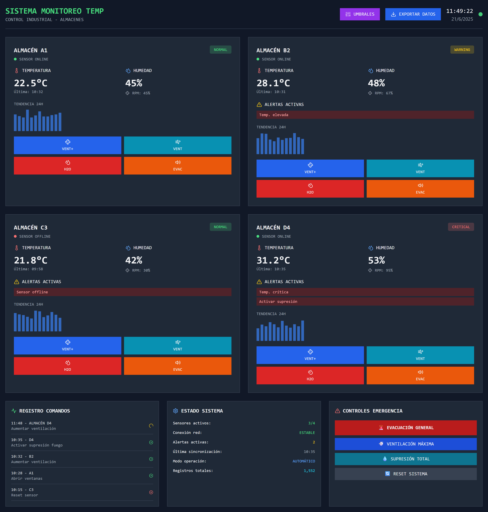
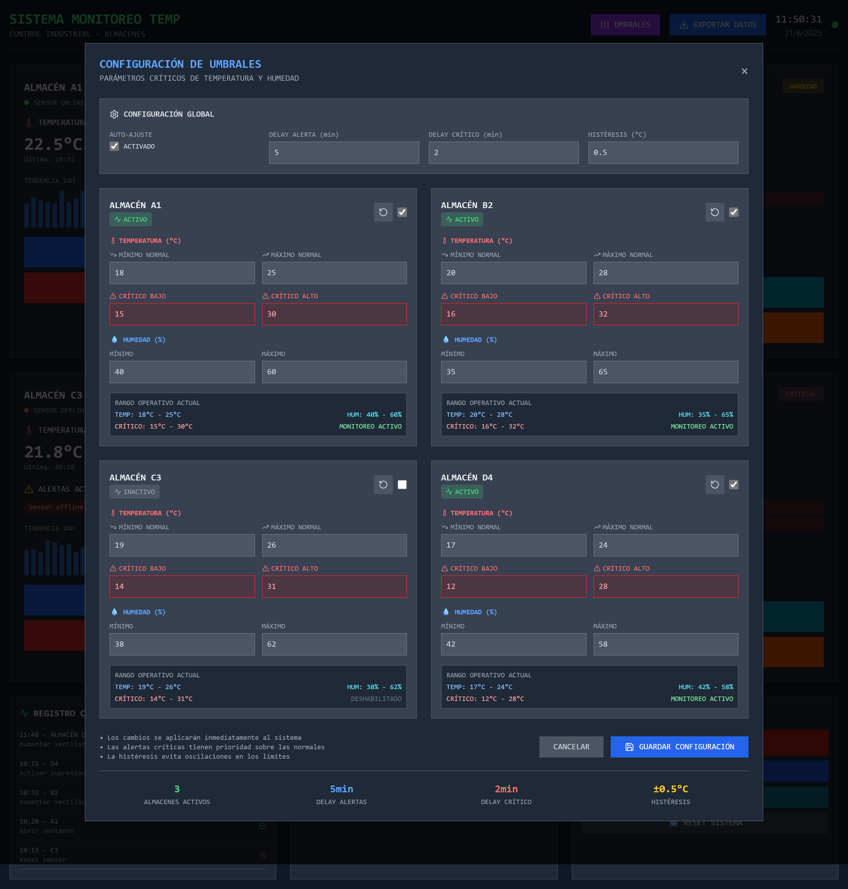
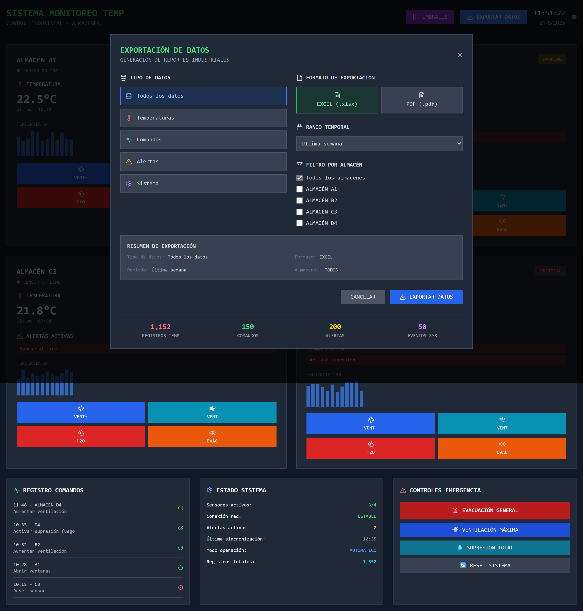

# SIMOTEMP_AI 🔥🧠

**Sistema Inteligente de Monitoreo de Temperaturas para Entornos Empresariales (SIMOTEMP_AI)** es una aplicación de monitoreo y control de temperatura para espacios industriales o empresariales, diseñada como proyecto académico para la cátedra de Inteligencia Artificial en Ingeniería de Sistemas.

Este sistema simula sensores de temperatura en cuatro habitaciones o almacenes, mostrando información visual y en tiempo real sobre las variaciones térmicas. Además, incluye una inteligencia artificial simbólica que analiza los datos recibidos y ejecuta acciones preventivas o correctivas según el nivel de temperatura, como activar ventiladores, aspersores o alarmas de evacuación.

> 🛠️ Este proyecto está construido con Vue.js y es de propósito educativo.

---

## 🚀 Funcionalidades Principales

- División en cuadrantes (4 micro módulos por habitación)
- Visualización de datos térmicos en registros y gráficos
- Panel tipo ingeniería industrial
- IA simbólica que toma decisiones automáticas
- Acciones simuladas como:
  - Activar ventiladores
  - Activar aspersores antiincendios
  - Emitir alarmas de evacuación

---

## 🧠 Tecnología de IA Usada

Este sistema utiliza un modelo de **IA simbólica basada en reglas**, permitiendo tomar decisiones automáticas con base en condiciones explícitas (IF - THEN). Se simula un sensor de temperatura para evaluar la lógica antes de integrar hardware real.

---

## 🖥️ Tecnologías Utilizadas

- Vue.js (Frontend)
- JavaScript (Lógica de IA)
- Chart.js (Visualización de datos)
- CSS Grid (Diseño tipo panel industrial)

---

## 📝 Requerimientos

- [Node.js](https://nodejs.org/es/) (v22.x)
- [Git](https://git-scm.com/)

---

## 📦 Instalación

Clona el repositorio e instala las dependencias:

1. Abre una terminal de PowerShell o CMD.
2. Ejecuta el siguiente comando para clonar el repositorio:

```bash
git clone https://github.com/RoyyertDev/SIMOTEMP_AI.git
```

3. Entra en la carpeta del proyecto:

```bash
cd SIMOTEMP_AI
```

4. Instala las dependencias:

```bash
npm install
```

5. Ejecuta el servidor de desarrollo:

```bash
npm run dev
```

---

## 📸 Capturas de Pantalla

### Panel Principal



### Configuración de Umbrales



### Exportación de Datos


